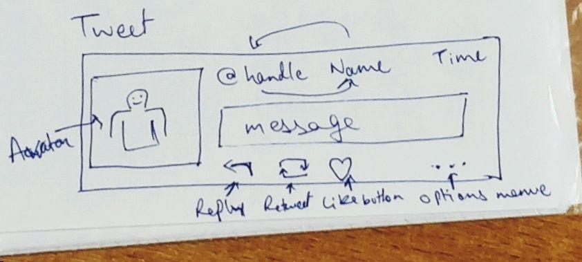
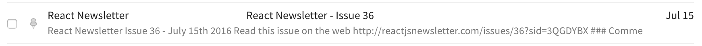

# Notes for Pure React by Dave Ceddia

<hr>

## Introduction <a name="introduction"></a>

### Method <a name="method"></a>

We will learn Pure React: The core concepts of React, in isolation, without Redux, Webpack, and the rest.

### What We’ll Cover <a name="what-we’ll-cover"></a>

1. Hello World.
2. How to compose static components and work with JSX.
3. “props” as a way to pass in the data they need, and “propTypes” for documenting and debugging the props that a component requires.
4. React’s special “children” prop, a powerful tool for building reusable, composable components.
5. Finally, “state,” how it differs from props, and how to organize it in an application. We’ll look at using form controls and the Component Lifecycle.

### Time Requirement <a name="time-requirement"></a>

The basic concepts of React can be learned in a matter of days. This book covers those basics and also contains exercises after each major concept to reinforce your understanding.

### How To Learn <a name="how-to-learn"></a>

#### Build A Lot Of Small Things <a name="build-a-lot-of-small-things"></a>

This is the awkward middle step that a lot of people skip. Moving on to Redux and other libraries without having a firm grasp of React’s concepts will lead straight back to overwhelmsville.

But this step isn’t very well-defined: what should you build? A prototype for work? Maybe a fancy Facebook clone, something substantial that uses the whole stack?

Well, no, not those things. They’re either loaded with baggage or too large for a learning project. You want to build small things.

#### Don’t Build a Prototype

“Prototypes” (for work) are usually terrible learning projects, because you know in your heart that a “prototype” will never die. It will live long beyond the prototype phase, morph into shipping software, and never be thrown away or rewritten. As soon as some manager sees that it works, features will be piled on. “We’ll refactor it some day” will turn out to be a lie. The code will grow bloated and disorganized.

When you know it won’t be throwaway code, the future looms large. You start to worry… Shouldn’t it have tests? I should make sure the architecture will scale… Am I going to have to refactor this mess later? And shouldn’t it have tests?

Worrying about architecture and scalability and “the future” is a bad strategy for learning the basics of a new technology.

On the flip side, if you build a prototype believing that it is throwaway code, it probably won’t be very good code. Then when your boss’ boss sees how awesome the prototype looks, he will absolutely not allow you to rewrite it with all the best practices you’ve learned. That’s a recipe for an unmaintainable code base.

#### What Should You Build

Build small, throwaway apps.

The sweet spot is somewhere between “Hello World” and “entire clone of Twitter.”

As your skill set grows, low-fidelity copies of simple apps and sites like Reddit, Hacker News, and Slack make good projects. Designers call this “copywork,”. They’ll come together quickly once you can clearly “think in components,” a skill you’ll develop as you progress through the book.

## Ex01: React Hello <a name="p01:-react-hello"></a>

### Step 1:
```bash
create-react-app react-hello
cd react-hello
rm src/App.* src/index.css src/logo.svg
```
### Step 2:
```js
import React from 'react';
import ReactDOM from 'react-dom';

function HelloWorld() {
  return (
    <div>Hello World!</div>
  );
}

ReactDOM.render(
    <HelloWorld/>,
    document.querySelector('#root'));
```
* `import` is ES6 and always at the top of `*.js` files.
* Unlike with ES5, we can’t include a `<script>` tag and get React as a global object. `import React from 'react'` creates a new variable called React with the contents of the react module.
* `‘react’` and `‘react-dom’` correspond to the names of modules installed by npm.
* `import React from 'react'` is equivalent to `var React = require('react')` in Node.js.

### Step 3

From inside the react-hello directory, start the app by running: `npm start`
A browser will open up automatically and display “Hello World!”

* **NOTE:** Got `error: ENOTFOUND x86_64-conda...` solved it by adding `HOST="localhost"` to `.bash_profile` and reloading environment variables by sourcing it; like so: `source ~/.bash_profile` following [this](https://medium.com/@choy/fixing-create-react-app-when-npm-fails-to-start-because-your-host-environment-variable-is-being-4c8a9fa0b461) link.

### How this code works?

Starting from bottom:

1. `ReactDOM.render` regular JS despite HTML looking `<HelloWorld/>` thing. React uses the concept of _virtual DOM_. It creates a representation of your component hierarchy and then renders those components by creating real DOM elements and inserting them where you tell it. In this case, that’s inside the element with an id of `root`.

2. `ReactDOM.render` takes 2 arguments, what to render (your component, or any other React Element) and where to render (a real DOM element), like so;

```js
ReactDOM.render([React Element], [DOM element]);
```

3. `HelloWorld` is a component. Primary way of writing components is as plain functions like this and called "stateless function components".
4. Two other ways of writing components: ES6 classes and the now-deprecated `React.createClass`.
5. HTML-like syntax inside render is JSX.

## [Ex02 JSX Exercises](./jsx-notes.md)

## Ex03 Tweet Example

We create a tweet component as follows:



### Component Hierarchy

* Tweet
  * Avatar
  * NameAndHandle
  * TweetTime
  * Message
  * ReplyButton
  * RetweetButton
  * LikeButton
  * OptionsButton

### Approach

For a simple component like this, it doesn't matter if we build __Bottom Up__ or __Top Down__. Here we will build __Top Down__.

Usually you'll mix the approaches, for example, if we were building Twitter, we might build the Tweet component top-down, then incorporate it into a list of tweets, then embed that list in a page, then embed that page into the larger application. The Tweet could be built top-down while the larger application is build bottom-up.

### Learnings

* `prop`: We started with a `Tweet` component with `className` attribute. The `className` is the `prop`. Most of them are named identically to the HTML attributes, but `className` is special in that its value becomes the `class` attribute on the DOM node.
* `import './index.css'` imports CSS into JS. When Webpack builds the app, it sees this CSS import and learns that `index.js` depends on `index.css` so Webpack includes it in the bundled JavaScript (as a string) to be sent to the browser. We can see this in the browser – open dev console > Elements tab, and notice under `<head>` there’s a `<style>` tag that we didn’t put there. It contains the contents of `index.css`.
* When i  tried to load an icon from local dir `../public/jodobear.jpg` it didn't load the icon but, from a CDN it did. [Icons CDN](https://icons8.com/icon/pack/free-icons/)
* `<i className="fa fa-reply reply-button"/>` creates a ~~clickable~~ symbol with reply icon.
* `<i className="fa fa-retweet retweet-button"/>` creates a ~~clickable~~ symbol with retweet icon.
* `<i className="fa fa-heart like-button"/>` creates a ~~clickable~~ symbol with heart(like) icon.
* `.time::before {..}` `::before`(`:*`) is _pseudo-element_.and _adds_ an element to the page. Old spec `:before` (`:*`) is _pseudo-selector_ just a selector that selects the appropriate element, e.g. `:nth-child(2)`.

#### `<i>`

The HTML `<i>` tag is used for specifying text in an alternate voice or mood, or otherwise offset from the normal prose.

In earlier versions of HTML, the `<i>` tag was typically used solely for rendering text in italics, however, this is not necessarily the case with HTML 5. Style sheets can be used to format this text (just like any other element).

To markup text with stress emphasis, you should use the HTML `<em>` tag.

To style text in italics, you should use the CSS `font-style` property.

## Props

__Keyword__: Arguments to Components

Where HTML elements have “attributes,” React components have “props” (short for “properties”). `props` itself is a dictionary with atrributes/properties as keys and their values as values. To refer to a specific prop, say `xyz`, use `props.xyz` while in ES6 you do `{ xyz }` that's the same.

We’ve already seen that React components can be written as functions, so it’s natural to assume that we could pass arguments to those functions. Props are the arguments to your components.

You can pass a prop using JSX to a React component like so; `<Person name='Alice'/>` or to an HTML element; `<div className='person'/>`.

Notice the `div` element is __self-closing__. In React __every element__ can be self-closing. In fact, convention is to self-close the component that has no children/contents.

e.g.
```js
function Alice() {
  const firstName = Alice;
  const lastName = Foo;
  return (
    <Person
      className='person'
      age={ 42 }
      name={ firstName + ' ' + lastName }
    />
  )
}
```
That translates in js to;
```js
function Alice() {
  const firstName = Alice;
  const lastName = Foo;
  return React.createElement(Person, {
    className: 'person',
    age: 42,
    name: firstName + ' ' + lastName
  }, null);
}
```
Note that the props become keys and values in the object, `null` here means no children.

#### React.createElement() arguments explained:

* __Signature:__ `React.createElement(type,props,children)`

* __type (string | `React.createClass()`):__ Can be a string which represents an HTML element (or custom HTML element) or React component instance (i.e., an instance of `React.createClass()`)

* __props (`null` | object):__ Can be `null` or an object containing attributes/props and values.

* __children (`null` | string | `React.createClass()` | `React.createElement()`):__

Children can be `null`, a string that gets turned into a text node, an instance of `React.createClass()` or `React.createElement()`.

### Receiving Props

Props are passed as first argument to a component function, like so;
```js
function Hello(props) {
  return <span>Hello, { props.name }</span>
};
```
And used like so;
```js
<Hello name='Alice' />
```
Using arrow functions:
```js
const Hello = (props) => (
  <span>Hello, { props.name }</span>
);
// name here is the `name` key of the prop/argument object.
```
ES6 _destructuring syntax for props:
```js
const Hello = ({ name }) => (
  <span> Hello, { name }</span>
);
```
This reads as extract the value for `name` key of the object passed as prop/argument. You can pass multiple keys, like so; `({ firstName, lastName })`. This is the common way to pass props.

Another way you can write props;
```js
const Hello = (props) => {
  const { name } = props;
  return (
    <span>Hello, { name }</span>
  );
};
```
### Modifying Props

__Keyword:__ You can't!

Props are _read only_. In React data flows _one way_. Components that receive props must not change them. Props can only be passed _down_ to children.

### Communicating with Parent

So how can you send data back to the parent?

__A:__ The parent can inject a function as a prop, like so;
```js
function handleAction(event) {
  console.log('Child did: ', event);
}
const Child = ({ onAction }) => (
  <button onClick={ onAction }/>
);
const Parent = () => (
  <Child onAction={ handleAction }/>
);
```
Here, `Child` receives `onAction` prop which it can call whenever needs to send up data to the `Parent`.

## Ex04 Props Tweet

* __NOTE on `cp`:__ Do not use `cp -r`, it doesn't preserve symlinks, it will break `npm start`. Use `cp -a`.
* If ever `npm start` fails, delete `node_modules` directory and run `npm install` then it should work.

### Method

1. Created a `testTweet` with a JSON object containing, `message`, `gravatar`, `author` object with `name` & `handle`, `likes`, `retweets` & `timestamp`.
2. Passed a prop `tweet` to the Tweet component.
3. In `ReactDOM.render()` method passed the prop with relevant value `tweet={ testTweet }` to the Tweet component.
4. In the `Tweet` component passed a prop `hash` to `Avatar` component that accepts the `tweet.gravatar` as value.
5. In the `Avatar` component passed the `hash` prop which was passed as a variable to the `url` variable. So, all the gravatars that are stored in some db can be accessed using the `hash` and the `url` becomes the `src` for `img`.
6. Similarly add props to all other components.

### Learnings

* Use the Airbnb style guide + check [this article](https://medium.com/@uistephen/style-guides-for-linting-ecmascript-2015-eslint-common-google-airbnb-6c25fd3dff0) and [this guide](https://css-tricks.com/react-code-style-guide/) and eventually create your own.

* To refer to items/keys inside an object use `object.key`.

* Make extensive use of ternary operators!

* There are many ways of writing one thing, chose one way of writing things and stick to it.

* `moment` package calculates time since the supplied timestamp, like so; `moment(timestamp).fromNow()`.

* I am dropping the `;` in js & react from now on.

* Deconstructing/unpacking objects: `const { name, handle } = author;`

* Always give functions an explicit `return`.

* Arrow functions - depends if it has only one expression or more.

### What to Pass as a Prop?

* Props accept everything; Numbers, Booleans, Strings, Objects and Functions.
* __Generalization Principle:__ Think of constructing general components. It is better to pass only relevant data/object to a component since then you can use it everywhere.

### Naming Props

* Follow the __Generalization Principle__.
* Keep names different than HTML/DOM props/attributes.

### RetweetButton

_REMEMBER:_ React components can only return __one__ element, notice the extra `<span>` in `RetweetButton`

When an expression evaluates to `null` or `false` inside a single braces JSX, nothing is rendered at all. To check, open devTools in the browser and check in the Elements tab, you won't see the `<span className="retweet-count">{count}</span>` when the `count === 0`.

The `getRetweetCount` can be turned into a general component itself by making it more general, like so;
```js
function Count({ count, object }) {
  return count > 0 ? <span className={`${object}-count`}>{count}</span> : null
}
```
Now i can use this anywhere.

### LikeButton

Note the following difference in code;
```js
{ /* this doesn't return the `span` with `like-count` when count === 0 */ }
      {count > 0 &&
        <span className="like-count">
          {count}
        </span>}
      { /* this will return `span` even if count === 0 */}
      <span className="like-count">
        {count > 0 ? count : null}
      </span>
```
The first way, note the `span` is returned if the condition is true while in the second way the condition is inside the `span`.

When i passed this expression; `{count > 0 ? {count} : null}` in the second way(note the braces around `count` when returning if condition `true`), i get the following error:

`Error: Objects are not valid as a React child (found: object with keys {count}). If you meant to render a collection of children, use an array instead.`

__Reason:__ We cannot return a Javascript object from inside a return call. React expects a component or some JSX or null to render the UI not some JS object and `{count}` is a JS object which is inside another JS object.

## PropTypes

* __Plain english:__ similar to the defining types in cpp, different syntax and method.
* Allow Documentation & Debugging in one method.
* Optional and have to import separately; `import PropTypes from 'prop-types';`
* Usage:
```js
function Comment ({ author, message, likes }) {
  return {
    <div>
      <div className="author">{author}</div>
      <div className="message">{message}</div>
      <div className="likes">
        {likes > 0 ? likes : null} likes
      </div>
    </div>
  }
}

Comment.propTypes = {
  author: PropTypes.string.isRequired,
  message: PropTypes.string.isRequired,
  likes: PropTypes.number
}
```
Note the following:
* `propTypes` is set as a property/attribute on the function/component/object itself, can be arrow func or ES6 class as well.

* We use the method `propTypes` (small `p`) on the component(object) while we import `PropTypes` (capital `P`).

* We define prop types as an object, note the `,` after each entry.

* To define the prop type we call the _class_ `PropTypes` (capital `P`), then the type of the prop and the optional keyword that specifies if it's required or not.

* All prop types are _optional_ by default so, no warnings if no value or typos.

* Warning if you pass a wrong type of prop or if the prop is not provided when `isRequired`.
* **IMPORTANT** if the prop type validation fails it will only return an error not _throw_ an error and break the code. Check the console for any errors.

* **Types:** `number`, `bool`, `string`, `array`, `func`, `object` or `symbol`(see below for description). Additionally,
  * **`node`:** anything that can be rendered i.e. numbers, strings, elements or an array of those.
  * **`element`:** a React element created with JSX syntax or by calling `React.createElement`.
  * **`elementType`:** a type of React Element, e.g. `Comment` from above.

### Validators

  * **`ProtoTypes.instanceOf(class)`:** validate whether the prop is of a particular `class`. Uses JS's `instanceOf` operator. When used, the prop must be an instance of that particular `class`.

  * **`PropTypes.oneOf(['a', 'b', 2, ..])`:** limit prop type to specific values.

  * **`PropType.oneOfType([PropTypes.string, PropTypes.number, PropTypes.instanceOf(class), ..])`:** limit the prop to one of specified types.

  * **`PropTypes.arrayOf(PropTypes.number)`:** limit the prop to an array of specified type.

  * **`PropTypes.objectOf(PropTypes.number)`:** the object should have values of specified type.

  * **`PropTypes.shape({student: PropTypes.string, id: PropTypes.number})`:** make the object of the specified shape. If it has more specified key value pairs then it won't give any warnings. **Not strict**.

  * **`PropTypes.exact({student: PropTypes.string, id: PropTypes.number})`** **Strict** will give warnings if anything more than what's specified is present.

  * **`PropTypes.any.isRequired`:** the object has to have some value, can't be undefined.

### Custom Validators

```js
// custom validator to check if len of prop is 3
function customValidator(props, propName, componentName) {
  // propName = "myCustomProp";
  if(props[propName].length !== 3){
    return new Error(
      'Invalid prop `' + propName + '` of `' + componentName + '` is not of length 3'
    );
  };
};
// component
function TestComponent({ myCustomProp }) {
  return (
    <div>{myCustomProp}</div>
  );
};
// defining the prop type
TestComponent.propTypes = {
  myCustomProp: customValidator
}
// no error:
ReactDOM.render(
  <TestComponent myCustomProp={[1, 2, 3]}/>,
  document.getElementById('#root')
);
// no error:
ReactDOM.render(
  <TestComponent myCustomProp="abc"/>,
  document.gerElementById('#root');
);
// error:
ReactROM.render(
  <TestComponent myCustomProp="largerThan3"/>,
  document.getElementById('#root')
);
```

### Ex05: Tweet with PropTypes

It was pretty clear except when doing the `Tweet` component. I did it using `exact` (i.e. exact `shape`) but, doesn't follow the DRY (Don't Repeat Yourself) principle since, had to duplicate the all the prop types to make it work.

Tried to use `object` but it wouldn't render and got the mentioned error. Check the docs on this error, [here](https://reactjs.org/warnings/dont-call-proptypes.html)
```js
// This give invariant error that you can't call PropTypes directly.
Tweet.propTypes = {
  tweet: PropTypes.object({
    message: PropTypes.string.isRequired,
    gravatar: PropTypes.string.isRequired,
    author: PropTypes.string.isRequired,
    likes: PropTypes.number,
    retweets: PropTypes.number,
    timestamp: PropTypes.string
  })
}
```
Then tried `objectOf` where it'd render but, got an `invalid PropType notation inside objectOf`:
```js
Tweet.propTypes = {
  tweet: PropTypes.objectOf({
    message: PropTypes.string.isRequired,
    gravatar: PropTypes.string.isRequired,
    author: PropTypes.exact({
      name: PropTypes.string.isRequired,
      handle: PropTypes.string.isRequired
    }).isRequired,
    likes: PropTypes.number,
    retweets: PropTypes.number,
    timestamp: PropTypes.string
  })
}
```
No matter what method i used, i pretty much duplicated the whole thing. How to do it following the DRY principle?

### Exercises: PropTypes

#### CSS

* `display: flex;` creates a flexible display.

* `position: relative;` makes all it's children's position relative to itself. Then in children use `position: absolute;` to position them in absolute terms from the relevant side of parent.

* `VALID <br/> THRU` this is how i got one element's text broken into two lines.

* To insert space between two elements you can just add `{' '}` or use `margin`/`padding` CSS properties.


Can't figure out even spacing of the elements.

## Children

Simple concept regarding how to deal with child elements. `children` is always pluralized, when there's one child, `children` is a single _React Element_ but, when there are multiple children, it's an _array_ of React Elements.

### Utility Functions

`React.Children` provides utilities for dealing with the `this.props.children` opaque data structure. Available functions:

* `React.Children.map(children, function)`: invokes the function on every _immediate_ child element. Returns an array.
* `React.Children.forEach(children, function)`: similar to map, but doesn't return an array.
* `React.Children.count(children, function)`: get the number of children.
* `React.Children.only(children, function)`: check if it's a single child else throws an error.
* `React.Children.toArray(children, function)`: returns the `this.props.children` opaque data structure as a flat array with keys assigned to each child. It changes keys to preserve the semantics of nested arrays when flattening lists of children i.e. it prefixes each key in the returned array s.t. each key is scoped to the input array containing it.

### PropTypes for Children

```js
// component can accept 0, 1 or more children.
propTypes: {
  children: PropTypes.node
}
// component only accepts 1 child. It will earn if not component or HTM element like string or number.
  children: PropTypes.element

// component accepts element or string
children: PropTypes.oneOf([
  PropTypes.element,
  PropTypes.string
])
// add .isRequired where needed.
```

### Exercises

#### **ErrorBox**:

Solved it, but for some reason the icon won't display(works on codepen). Finally understand what's a child and how they get referred.

#### **Nav**

- Got stuck at `each child should have unique "key"` error. I pass the index of children to a `span` with `key` but, the span doesn't get the `key` attribute itself(!). Check [this](https://stackoverflow.com/questions/40044861/get-key-index-on-click-es6-react) and the link in the browser console error.

  - The reason `span` doesn't get the `key` attribute is because React works with virtual DOM and this particular instance `key` is applied to the virtual DOM so that React has proper reference to the elements. It _DOES NOT_ add it in the actual DOM element.
  - This code is not required and redundant since we add the keys while adding separator and the elements get the same `key` values twice:
  ```js
  // the following doesn't add the key!
  const keyedItems = items.map((item, i) =>
    <span key={2 * i} >{item}</span>
  );
  ```
  * Despite, the keys being added to the children when we add the separator, we still ger `Warning: Each child in a list should have a unique "key" prop. See https://fb.me/react-warning-keys for more information.` in the console.

- Can't figure out how to type check for elementType using the `propType: {}` syntax(!). Only the `try {..} catch{..}` method works. Check these links; [propTypes, children](https://stackoverflow.com/questions/42122522/reactjs-what-should-the-proptypes-be-for-this-props-children), [propTypes validation](https://stackoverflow.com/questions/27366077/only-allow-children-of-a-specific-type-in-a-react-component)

- Tried to update the `PropType` and got a new error:
```
Warning: Failed prop type: Invalid prop `children[0]` of type `Object` supplied to `Nav`, expected instance of `NavItem`.
    in Nav (at src/index.js:109)
```
code:
```js
Nav.propTypes = {
  children: PropTypes.arrayOf(PropTypes.instanceOf(NavItem))
}
```

- Finally, this is still persistent: `Warning: Each child in a list should have a unique "key" prop. See https://fb.me/react-warning-keys for more information.`

#### Dialog

1. The Dialog box is persistent even when i have a `close button` element, like so; `<button className="fa fa-close" value="close" id="close" onClick={this.close()}>Close</button>`. Doesn't close. Additionally, when i add the `onClick` it doesn't render and gives `TypeError: Cannot read property 'close' of undefined`.

2. The `button` is rendered on the left since, `flex-direction: column;`. Failed to align it to the right.

3.`PropType` definitions for `Dialog` also haven't been correctly defined, though it changes the error if i change something, error; `Failed prop type: Right-hand side of 'instanceof' is not callable in Dialog (at src/index.js:115)`

## Example: Github File List

### Component Hierarchy
- File List
  - File item
    - File icon
    - File Name
    - Commit message
    - Time

Lots of things i learnt/reinforced in this exercise.

### CSS

- Think about the container of the content you are trying to align. Maybe that's where you should be applying the styles. I was trying to align date to the right margin but, it wouldn't work since i was applying it to the `Time` component itself which was passed inside a `td` element. When i applied it to the `td` element, it worked.

- `border-collapse: collapse;` ?????

- ` overflow` deals with the content overflow from view.

### JS

- Font Awesome: finally worked after changing the link to: `https://cdnjs.cloudflare.com/ajax/libs/font-awesome/4.7.0/css/font-awesome.min.css`

- It was a cool idea to display the list in the form of a table. That way the items just became table data. Also, aligned themselves well.

- I didn't think of implementing the list as an array, which is natural and makes sense.

- For now, (20-01-20) first session, we did a basic implementation, no children nothing.

- Named exports:
```js
// using default syntax
// export default Time;
// import, like so: import Time from './time'

// named export
export { Time }
// import, like so: import { Time } from './time'
```

- When rendering an array of children, use `map` to resolve the `unique id` issue.